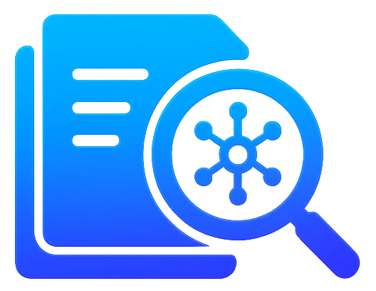
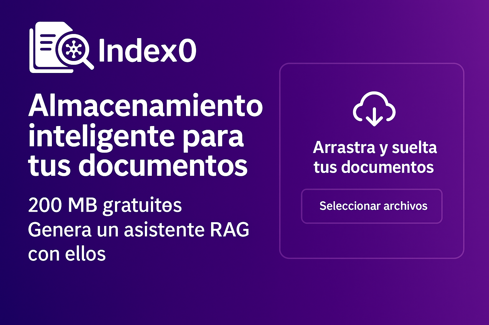
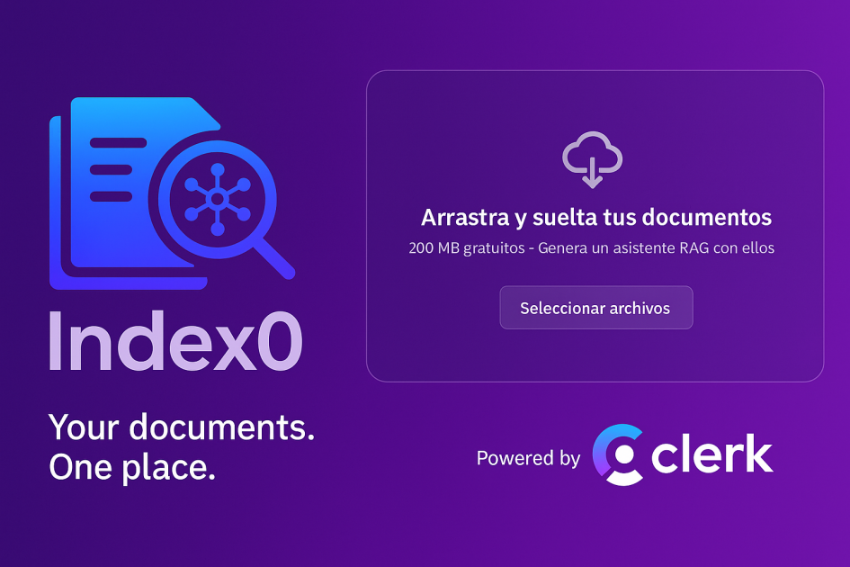
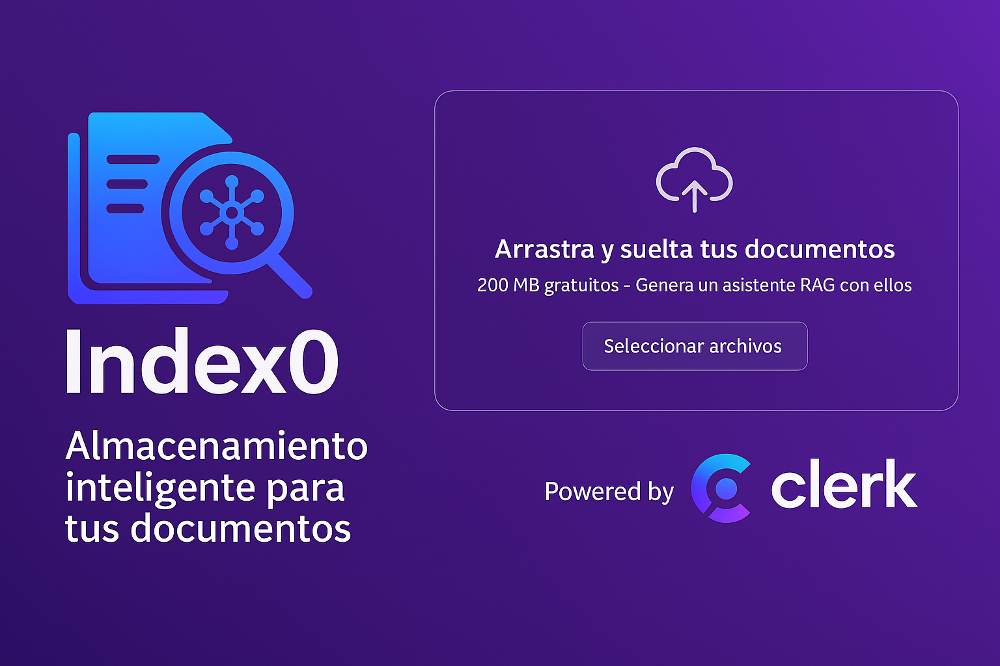

# Index0



This is a [Next.js](https://nextjs.org) project bootstrapped with [`create-next-app`](https://nextjs.org/docs/app/api-reference/cli/create-next-app).

## Application Description

Index0 offers a complete workflow for managing, searching, and conversing with your own documents:

### Secure Upload and Storage

- Users log in (e.g., with Clerk) and have access to private folder spaces
- Drag and drop or select files (Word, PDF, images, Excel, etc.) directly from your browser
- Only files that meet configured maximum size limits (e.g., 200 MB free) are stored; those exceeding the threshold display an error message and are not uploaded

### Automatic Indexing

- After upload, valid files are saved in Cloudflare R2 (or similar) and simultaneously processed:
  - Metadata extraction (name, date, folder, tags)
  - Text and images tokenization and vectorization (embeddings) in a vector store

### Semantic Search

- In the "Search Documents" interface, users can write any query
- The system converts the query to an embedding and retrieves the most relevant fragments based on semantic similarity (/search)
- Displays titles, scores, and text extracts that match the search

### Conversational Assistant (Custom RAG)

- In chat, users can ask questions in natural language ("Where do I talk about invoicing in my reports?")
- The backend calls /ai-search:
  - Retrieves the most relevant fragments from your repository
  - Passes those fragments + your question to a generation model (e.g., Llama, GPT)
  - Returns an integrated, explanatory, and referenced response, along with source documents

### Traceability and Control

- Each chat response includes a list of files and fragments used (ID, name, score, folder)
- Users can filter by folders, dates, or tags to refine both searches and conversations

Overall, the application combines:

- Privacy and security for your files
- Speed and accuracy of semantic search
- Advanced conversational experience thanks to RAG, saving you from manually reviewing multiple documents

## Getting Started

First, run the development server:

```bash
npm run dev
# or
yarn dev
# or
pnpm dev
# or
bun dev
```

Open [http://localhost:3000](http://localhost:3000) with your browser to see the result.

You can start editing the page by modifying `app/page.tsx`. The page auto-updates as you edit the file.

This project uses [`next/font`](https://nextjs.org/docs/app/building-your-application/optimizing/fonts) to automatically optimize and load [Geist](https://vercel.com/font), a new font family for Vercel.

## Application Screenshots





## Resources

-  [Visit our website](https://index0.io)
-  [Follow us on Twitter](https://twitter.com/index0_io)

## Learn More

To learn more about Next.js, take a look at the following resources:

- [Next.js Documentation](https://nextjs.org/docs) - learn about Next.js features and API.
- [Learn Next.js](https://nextjs.org/learn) - an interactive Next.js tutorial.

You can check out [the Next.js GitHub repository](https://github.com/vercel/next.js) - your feedback and contributions are welcome!

## Deploy on Vercel

The easiest way to deploy your Next.js app is to use the [Vercel Platform](https://vercel.com/new?utm_medium=default-template&filter=next.js&utm_source=create-next-app&utm_campaign=create-next-app-readme) from the creators of Next.js.

Check out our [Next.js deployment documentation](https://nextjs.org/docs/app/building-your-application/deploying) for more details.

```

```
